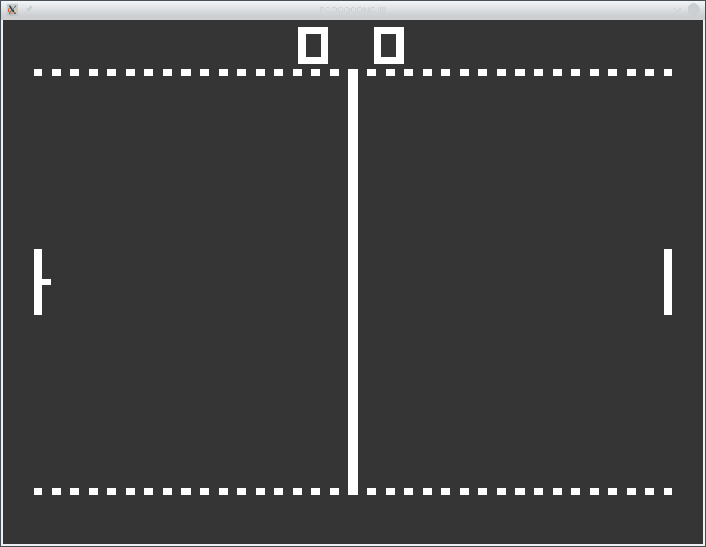

# PONG

## Einleitung ##
Jeder Spieler hat einen Schläger den er per Tastatur nach oben und nach unten bewegen kann. Wie beim Tennis
wird ein Ball hin und her geschlagen. Kann der Ball mit dem Schläger nicht getroffen werden so bekommt der
Gegner einen Punkt. Wer zuerst 9 Punkte erreicht, hat gewonnen.

## Steuerung ##

Gespielt wird mittels Tastatur.

#### Spieler 1: ####

Hoch   - Q  
Runter - A

#### Spieler 2: ####

Hoch   - CURSOR HOCH  
Runter - CURSOR HOCH

Ball Start: Space
Neustart: R

Beenden: ESCAPE

### [Letzte Version hier ...](https://github.com/ThKattanek/pong/releases)



## Used libraries
* SFML

## Compiling and installing
```bash
cd ~
git clone https://github.com/ThKattanek/pong.git
cd pong
mkdir build
cd build
cmake .. -DCMAKE_INSTALL_PREFIX=/usr/local
make
make install
```
## Compiling for Windows x32 with MXE (Crossdev)
```bash
cd ~
git clone https://github.com/ThKattanek/pong.git
cd pong
mkdir build-win-x32
cd build-win-x32
[MXE-PATH]/usr/bin/i686-w64-mingw32.static-cmake .. -DSFML_STATIC_LIBRARIES=TRUE
make
```
## Compiling for Windows x64 with MXE (Crossdev)
```bash
cd ~
git clone https://github.com/ThKattanek/pong.git
cd pong
mkdir build-win-x64
cd build-win-x64
[MXE-PATH]/usr/bin/x86_64-w64-mingw32.static-cmake .. -DSFML_STATIC_LIBRARIES=TRUE
make
```
## Complete build and create the windows versions (32/64bit) as 7zip with Script (crossbuild_win_releases.sh)
```bash
cd ~
git clone https://github.com/ThKattanek/pong.git
cd pong
./crossbuild_win_releases.sh [MXE-PATH]
```
The Script creates 1 folder

* public_release

In this folder is the new 7zip packages (32Bit/64Bit) for windows.

### [MXE Website](http://mxe.cc)